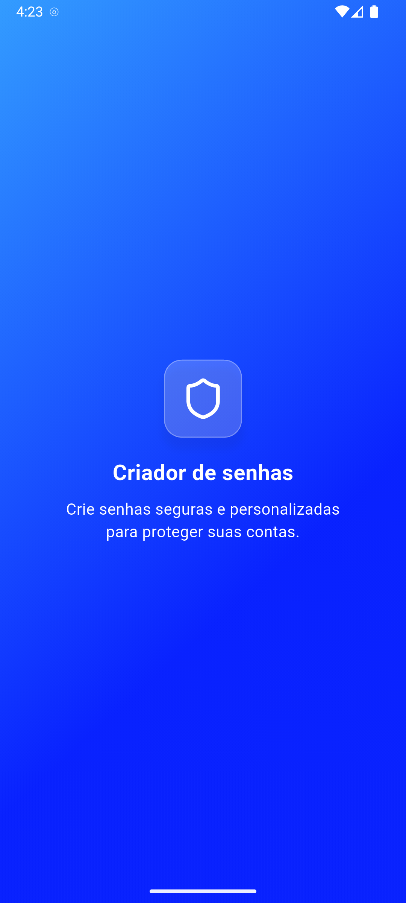
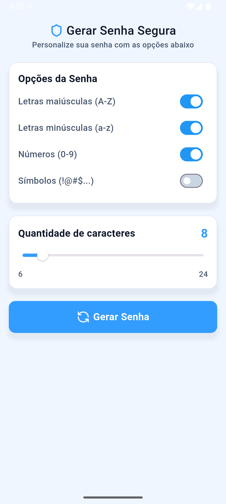
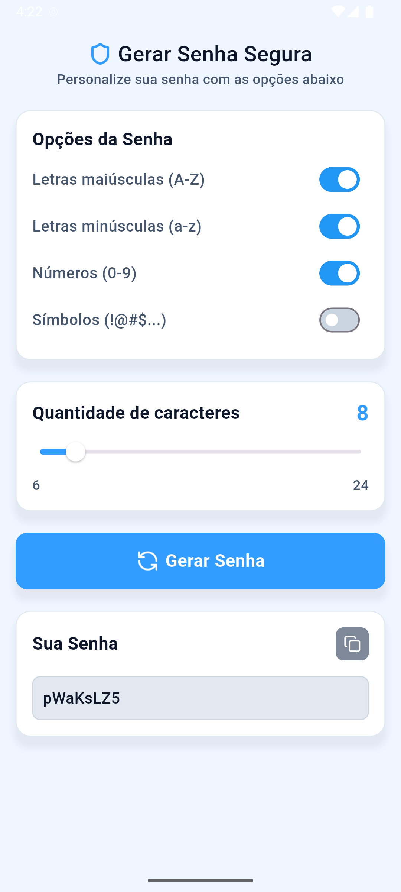

# Gerador de senhas

Um aplicativo em flutter para gerar senhas personalizadas, com opções de configuração como letras maiúsculas, minúsculas, números e símbolos. O app também permite que o usuário defina a quantidade de caracteres e copie a senha gerada. 

*Todo o visual foi criado a partir da geração de um mockup de uma inteligência artificial de design ui, a que eu usei foi a [MagicPath](https://www.magicpath.ai/).*

## Funcionalidades

- Inclusão de letras maiúsculas (A-Z)

- Inclusão de letras minúsculas (a-z)

- Inclusão de números (0-9)

- Inclusão de símbolos (!@#$...)

- Definição da quantidade de caracteres (de 6 a 24)

- Botão para gerar nova senha

- Copiar senha 

## Telas

| Splash                              | Escolha das opções                           | Senha Gerada                                  |
| ---------------------------------------------- | ---------------------------------------------- | ---------------------------------------------- |
|  |  |  |

## Tecnologias usadas

- Flutter
- Dart
- SetState
- Widgets como Switch, Slider, GestureDetector, Clipboard, Random

## Organização do projeto

```python
lib/
├── main.dart                    
├── pages/                                  # Telas principais do app
│   └── home_page                           # Tela de inicio
│   │   └── home_page.dart 
│   │   └── home_page_view.dart             # Contém a visualização da home
│   │   └── home_page_view_model.dart       # Contém a lógica da home     
│   └── splash_page                         # Tela de splash, ao iniciar o app já aparece esse tela
│   │   └── splash_page.dart                
│   │   └── splash_page_view.dart           # Contém a visualização da splash
│   │   └── splash_page_view_model.dart     # Contém a lógica da splash                
├── components/                     
│   └── my_text.dart                        # Componente de texto para ser reutilizavel
└── app/                      
    └── app_colors.dart                     # Classe que representa as cores do app, sendo referenciadas onde precisam de color
```

## Como executar

```python
git clone https://github.com/anacarolinn/passwordgenerate.git
cd password_generator_flutter
flutter pub get
flutter run
```

# Motivação

A motivação da criação desse app foi afim de aprender, estou estudando flutter e achei que seria uma boa ideia criar esse app, como outros que serão criado. Não quis me apegar muito ao layout do app por isso usei uma IA para me gerar o visual e ai foi simples criar tudo aqui no flutter. App criado com muita pesquisa sobre widgets e funcionalidades que até então eu não conhecia no flutter. 

**Até que eu gostei!**
